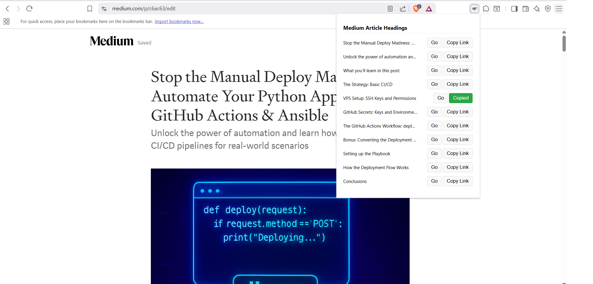

### **🚀 Medium Writer Helper**

**A browser extension to effortlessly create a table of contents on Medium. ✍️**

---

### **The Problem**

Creating a table of contents for a Medium post is a manual and tedious process. You have to open the browser's developer tools, inspect each heading, find its unique `name` attribute, and then manually insert a link with a `#` followed by that name. This breaks your writing flow and is highly inefficient.

---

### **The Solution**

The **Medium Headings Linker** is a lightweight browser extension that automates this process for you. When you're in the Medium editor, simply click the extension icon to instantly see a list of all your headings. Each heading comes with two convenient buttons: a **"Copy Link"** button to copy the heading's anchor name to your clipboard and a **"Go"** button to quickly navigate to that section in your article.

This extension is built to be simple, fast, and secure. It runs only when you click it and only on Medium's editor pages, ensuring it doesn't interfere with your browsing.

---

---

### **How It's Built**

The extension is a simple **popup** that uses the standard WebExtension API. It leverages Chrome's `scripting` API to inject and run a small piece of code directly into the active Medium tab. This script finds all `h1` through `h4` elements and extracts their unique `name` attribute. It then sends this data back to the extension's popup, where the user interface is rendered. The "Go" and "Copy Link" functionalities are also handled by injecting scripts to either scroll the page or write to the user's clipboard, respectively.

---

### **How to Install** 🛠️

Currently, this extension is not available in the Chrome Web Store. You can install it manually in developer mode.

1.  Open your browser and navigate to the extensions page by typing `chrome://extensions` or `edge://extensions` in the address bar.
2.  Enable **"Developer mode"** using the toggle switch in the top-right corner.
3.  Click the **"Load unpacked"** button.
4.  Select the folder containing your extension's files (`manifest.json`, `popup.html`, `popup.js`, etc.).

The extension icon will now appear in your browser's toolbar.
