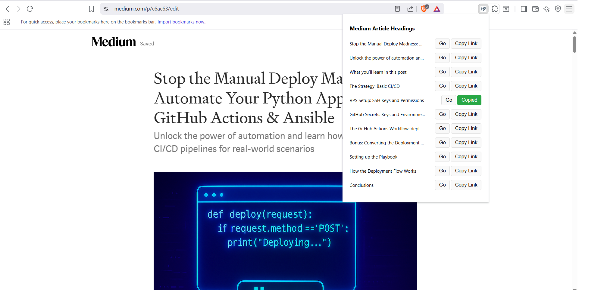
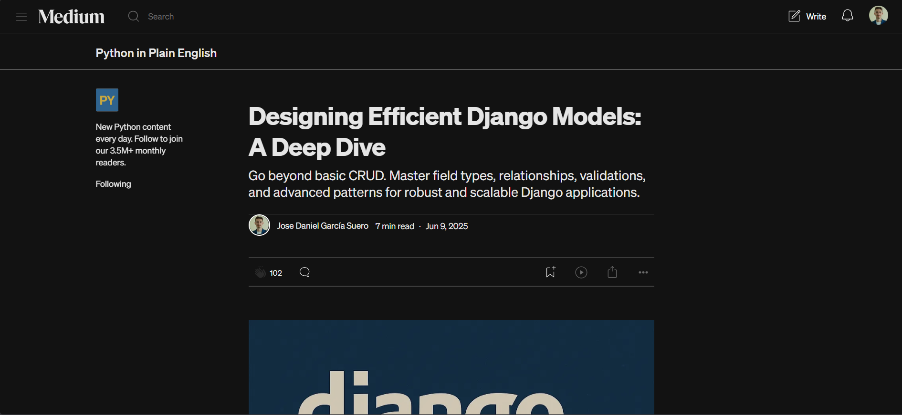

### **🪶 Medium Writer Helper**

**A browser extension to effortlessly create tables of contents and write in Dark Mode on Medium. ✍️**

---

### **The Problem**

Writing and navigating on Medium can be tedious:
1. **Manual Table of Contents**: Creating anchors for headings requires inspecting code, which breaks your writing flow.
2. **No Native Dark Mode**: Medium lacks an automatic dark mode for its web version, making it uncomfortable to write or read at night.

---

### **The Solution**

The **Medium Writer Helper** is a lightweight tool that enhances your Medium experience:

- **Table of Contents**: Instantly see all your headings (`h1`-`h4`) in the editor. One click to copy the anchor link or go directly to that section.

- **Universal Dark Mode**: Force a premium dark theme on any Medium page. It's automatic, persists as you navigate, and even syncs the extension's own interface.

---

### **How It's Built**

The extension is built using the standard WebExtension API (Manifest V3):
- **Popup UI**: Built with HTML/CSS and themed with CSS variables for dark mode support.
- **Scripting API**: Injects logic to extract headings and handle navigation.
- **Content Scripts**: Automatically applies your Dark Mode preference on any Medium page using `chrome.storage`.
- **Message Passing**: Ensures the UI and the page sync instantly when toggling themes.

---

### **Looking for the story behind this?** 📖
Read the full article on Medium describing the motivation and development process:
[**Elevate Your Medium Writing: How I Built a Dark Mode & Table of Contents Helper**](https://medium.com/@your-username/elevate-your-medium-writing-how-i-built-a-dark-mode-table-of-contents-helper-some-id)

---

### **How to Install** 🛠️

For now, the extension is available in **Developer Mode**. Follow these steps to install it in less than a minute:

1.  **Download the Code**: Clone this repository or download it as a ZIP and extract it.
2.  **Open Extensions Page**: Go to `chrome://extensions` in your browser.
3.  **Enable Developer Mode**: Toggle the switch in the top-right corner.
4.  **Load the Extension**: Click **"Load unpacked"** and select the folder where you saved the code.

The extension icon will now appear in your browser's toolbar. Pin it for quick access!

---

### **Contributing & Feedback** 💡

This project is currently maintained by the author. If you find any bugs or have suggestions, please feel free to [open an issue](https://github.com/joegsuero/medium-writer-helper-extension/issues).

---

### **License** 📜

This project is licensed under the **MIT License**. You are free to share, adapt, and use the code for any purpose, including commercial ones, as long as the original copyright and license notice are included. See the [LICENSE](LICENSE) file for details.
